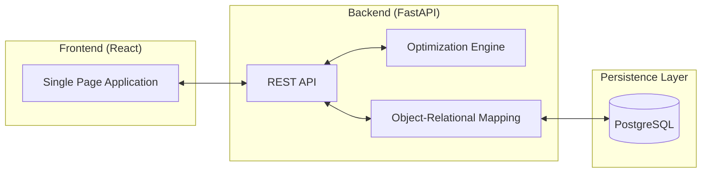

# System & Data Architecture

This document outlines the technical design of the Workforce Scheduling Platform, with a particular focus on the data modeling and optimization logic that drives operational efficiency.

## 🏗️ High-Level Design

The platform follows a decoupled client-server architecture, ensuring a clear separation between the presentation layer and the core business logic (optimization engine).

## 📊 Data Modeling & Analytics

The database schema is designed to reflect real-world organizational constraints, enabling both operational execution and deep administrative analytics.

- **Entity-Relationship Design:** Structured PostgreSQL schema that ensures referential integrity across users, shifts, and preference modules.
- **Coverage Analytics:** The backend computes shift coverage metrics (Requirements vs. Actual Assignments), allowing administrators to identify and address staffing vulnerabilities.
- **Availability Heatmaps:** Data aggregations provide a visual representation of "high-risk" time slots where shift preferences are lowest.

## 🤖 Optimization Engine (Product & Data Focus)

The core competitive advantage of this platform is the automated scheduling algorithm, implemented using **Constraint Programming (Google OR-Tools)**.

### Solving the "Shift Scheduling Problem"
We model scheduling as a mathematical optimization problem where we minimize "unhappiness" (preferences not met) while adhering to strict operational constraints.

1. **Hard Constraints (Operational Integrity):**
   - **Full Coverage:** Every shift must be assigned $N$ employees as defined by the requirement.
   - **Zero Conflict:** No student worker can be scheduled for overlapping time blocks.
   - **Eligibility:** Workers are only assigned to shifts where they have explicitly marked availability.

2. **Soft Constraints (Optimization Targets):**
   - **Fairness Index:** Balancing the total hours worked across the employee pool to prevent burnout and ensure equitable pay opportunities.
   - **Preference Weighting:** Maximizing the cumulative preference score across the entire schedule.

## 🛠️ Technology Stack Rationale

- **FastAPI:** Chosen for its superior performance in I/O bound operations (DB queries) and built-in data validation (Pydantic).
- **React & Tailwind CSS:** Selected to deliver a high-quality, data-dense UI that remains performant and accessible.
- **PostgreSQL:** The gold standard for relational data, providing the consistency required for complex scheduling operations.

## 🔐 Security Standards

- **JWT (JSON Web Tokens):** Secure, stateless authentication.
- **BCrypt:** Salted password hashing for industry-standard security.
- **RBAC (Role-Based Access Control):** Granular permission sets for 'Admin' (Data Controller) and 'Student' (Data Contributor) roles.
